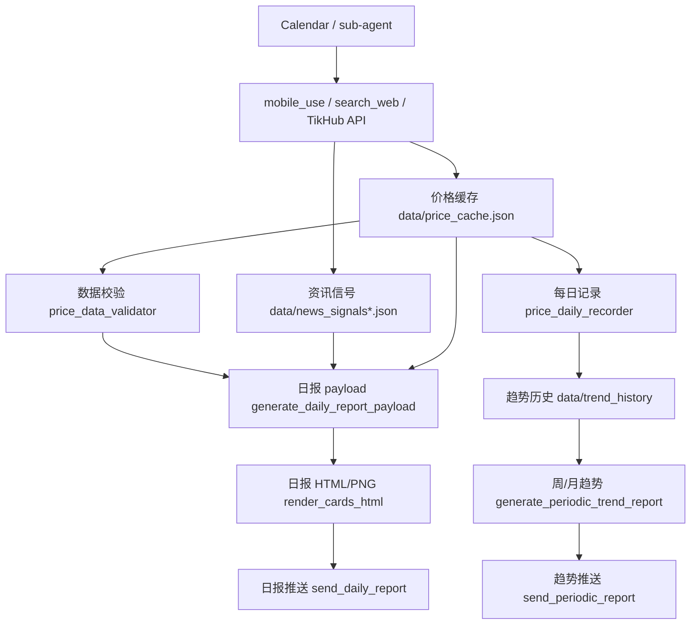

# 行情追踪AI助手架构说明

> 当前口径：v2.14.1。本文定义模块边界和数据契约；真实调度仍以 `config/schedule.json` 与 `config/calendar_subagent_schedules.json` 为准。

## 一、设计原则

1. **调度和采集分离**：Calendar/sub-agent 负责触发和调用 `mobile_use`、`search_web`、TikHub API；Python 只做验证、记录、归档、分析、渲染和推送。
2. **数据先落盘，后处理再消费**：采价、资讯、状态、日报、趋势报告都必须先写入 `data/` 下的结构化文件，再由下游模块读取。
3. **生成和推送分离**：日报/周报/月报生成模块只负责产出 payload、HTML、PNG；推送模块只读取已生成产物并发送。
4. **图片统一 HTML 截图**：所有推送图片走 `payload -> HTML/CSS -> 浏览器截图 -> PNG`，禁止新增 PIL 直接绘图入口。
5. **失败只发失败通知**：图片或数据链路失败时，不允许用完整 Markdown 长文替代图片日报。

## 二、模块总览

| 模块 | 职责 | 只生成数据 | 负责推送 | 主要入口 |
| --- | --- | --- | --- | --- |
| 调度模块 | 定义时间窗口、工具调用、后处理顺序 | 是 | 否 | `config/schedule.json`, `config/calendar_subagent_schedules.json` |
| 采价模块 | 采集闲鱼、闲鱼官方、爱回收、转转等价格 | 是 | 否 | Calendar sub-agent, `scripts/update_xianyu_market.py`, `scripts/generate_mobile_use_task.py` |
| 资讯信号模块 | 采集 TikHub/search_web 信号并分级去重 | 是 | 否 | `scripts/fetch_tikhub_signals.py`, `scripts/news_signal_filter.py` |
| 数据校验模块 | 校验价格缓存、缺失项、异常字段 | 是 | 否 | `scripts/price_data_validator.py` |
| 价格记录归档模块 | 生成每日价格记录和趋势历史 | 是 | 否 | `scripts/price_daily_recorder.py`, `scripts/price_archiver.py` |
| 异动与置信度模块 | 计算价格异动、信号可信度、告警等级 | 是 | 可触发告警 | `scripts/confidence_calculator.py`, `scripts/volume_price_judge.py`, `scripts/alerting.py` |
| 日报生成模块 | 生成每日统一 payload | 是 | 否 | `scripts/generate_daily_report_payload.py` |
| 图片渲染模块 | 把 HTML 模板截图为 PNG | 是 | 否 | `scripts/render_cards_html.py`, `scripts/generate_periodic_trend_report.py` |
| 周期趋势模块 | 生成周报/月报趋势 payload、HTML、PNG | 是 | 否 | `scripts/generate_periodic_trend_report.py` |
| 推送模块 | 发送日报、周报、月报、失败通知 | 否 | 是 | `scripts/send_daily_report.py`, `scripts/send_periodic_report.py` |
| 基准线模块 | 基于历史价格更新 baseline | 是 | 否 | `scripts/update_baseline.py` |
| 云电脑扫描模块 | 轻量价格扫描和异动缓存 | 是 | 仅即时告警 | `scripts/run_cloud_pc_scan.py`, `cloud-pc-monitor/` |
| 运维与恢复模块 | 初始化状态、备份、快照、看门狗 | 是 | 可告警 | `scripts/init_daily_status.py`, `scripts/daily_backup.py`, `scripts/collect_debug_snapshot.py`, `scripts/watchdog.py` |

## 三、模块边界

### 1. 调度模块

**输入**

- `config/schedule.json`
- `config/calendar_subagent_schedules.json`
- Calendar/sub-agent 外部执行环境

**输出**

- 被触发的工具调用任务
- Python 后处理命令序列

**边界**

- 只定义“什么时候做、调用什么工具、后处理顺序是什么”。
- 不直接修改价格、资讯、日报正文。
- 不直接承担推送内容生成。

### 2. 采价模块

**输入**

- `config/categories.json`
- `config/mobile_use_templates.json`
- Calendar sub-agent 的 `mobile_use` / `search_web` 结果
- 可选补录文件，例如外部采价结果 JSON

**输出**

- `data/price_cache.json`
- 平台分缓存，如 `data/aihuishou_cache.json`、`data/xianyu_official_cache.json`
- 采价失败原因、样本数、更新时间

**边界**

- 只负责采价和写缓存。
- 不负责日报排版。
- 不负责趋势计算。
- 不负责正式推送。

**价格字段约定**

- 闲鱼自由市场：优先 `xianyu_market.price`，兼容 `median`、`avg`、`avg_price`
- 闲鱼官方：`xianyu_official.price`
- 转转回收：`zhuanzhuan_recycle.price`
- 爱回收：`aihuishou.tansuo_price`、`base_price`、`after_coupon`

### 3. 资讯信号模块

**输入**

- TikHub B站/小红书搜索结果
- `search_web` 异动关键词结果
- `config/tikhub_sources.json`
- `data/news_signal_dedupe_history.json`

**输出**

- `data/tikhub_signals.json`
- `data/news_signals.json`
- `data/news_signals_filtered.json`
- S/A/B 分级信号

**边界**

- 只负责资讯采集、去重、时效过滤、信号分级。
- 不负责价格缓存写入。
- 不直接推送日报；S 级可交给告警模块即时通知。

### 4. 数据校验模块

**输入**

- `data/price_cache.json`
- 资讯信号文件
- `config/categories.json`
- 阈值配置

**输出**

- `data/validation_report.json`
- 缺失项、字段异常、平台覆盖率、风险项

**边界**

- 只报告数据质量和可用性。
- 不推测价格。
- 不直接修复原始采集结果，除非脚本职责明确是兼容转换。

### 5. 价格记录归档模块

**输入**

- `data/price_cache.json`
- `config/baseline.json`
- `data/daily_price_records/`

**输出**

- `data/daily_price_records/YYYY-MM-DD.json`
- `data/trend_history/{product_id}/YYYY-MM-DD.json`
- 归档后的历史价格序列

**边界**

- 只负责把当日价格固化成历史记录。
- 不负责筛选日报展示机型。
- 不负责推送和图片生成。

### 6. 日报生成模块

**输入**

- `data/price_cache.json`
- `data/news_signals_filtered.json`
- `data/validation_report.json`
- `data/daily_price_records/`
- `config/categories.json`

**输出**

- `data/daily_report_payload.json`

**边界**

- 只生成统一日报 payload。
- 不生成 PNG。
- 不直接推送。
- 不读取旧 Markdown 报告作为事实源。

### 7. 图片渲染模块

**输入**

- `data/daily_report_payload.json`
- `templates/price_card.html`
- 周/月趋势 payload
- `templates/periodic_trend_card.html`

**输出**

- 日报 HTML：`data/report_cards/*.html`
- 日报 PNG：`data/report_cards/*.png`
- 周/月趋势 HTML：`data/periodic_reports/*_trend_card.html`
- 周/月趋势 PNG：`data/periodic_reports/*_trend_card.png`

**边界**

- 只负责把结构化数据渲染为 HTML，并截图成 PNG。
- 不采集数据。
- 不推送。
- 截图失败必须失败退出，不能静默生成坏图。

### 8. 推送模块

**输入**

- `data/daily_report_payload.json`
- `data/report_cards/*.png`
- `data/periodic_reports/*_trend_payload.json`
- `data/periodic_reports/*_trend_card.png`
- `data/push_status.json`
- webhook 或目标渠道配置

**输出**

- 企业微信/扣子/其他渠道消息
- `data/push_status.json` 更新

**边界**

- 只负责发送已生成内容。
- 不现场重新采价。
- 不现场重新分析趋势。
- 图片不存在时只发失败通知，不发完整 Markdown 替代。

### 9. 周期趋势模块

**输入**

- `data/trend_history/`
- `data/anomaly_votes_archive/`
- `config/baseline.json`
- `config/categories.json`

**输出**

- `data/periodic_reports/YYYY-MM-DD_weekly_trend_payload.json`
- `data/periodic_reports/YYYY-MM-DD_weekly_trend_card.html`
- `data/periodic_reports/YYYY-MM-DD_weekly_trend_card.png`
- `data/periodic_reports/YYYY-MM-DD_monthly_trend_payload.json`
- `data/periodic_reports/YYYY-MM-DD_monthly_trend_card.html`
- `data/periodic_reports/YYYY-MM-DD_monthly_trend_card.png`

**边界**

- 只做 7天/30天趋势汇总。
- 不替代每日价格卡。
- 不负责正式日报推送。

### 10. 基准线模块

**输入**

- `data/trend_history/`
- `config/baseline.json`
- 自适应阈值配置

**输出**

- `data/baseline_update_proposal.json`
- 更新后的 `config/baseline.json`，仅在 apply 模式或确认后写入

**边界**

- 只负责 baseline 评估和更新建议。
- 不负责采价。
- 不负责日报文案。

## 四、核心数据流



## 五、调度流

| 时间 | 模块 | 主要动作 | 下游 |
| --- | --- | --- | --- |
| 05:30 周一 | 基准线模块 | 自适应更新 baseline 提案 | 周报趋势 |
| 07:30 | 采价模块 | 闲鱼市场价采集，生成日报图 | 10:00 日报推送 |
| 09:00 | 资讯信号模块 | TikHub 资讯采集、过滤 | 日报 payload |
| 09:00 周一 | 周期趋势模块 | 生成并推送周趋势报告 | 周报推送 |
| 09:00 每月1日 | 周期趋势模块 | 生成并推送月趋势报告 | 月报推送 |
| 10:00 | 推送模块 | 检查日报 PNG 并正式推送 | `push_status` |
| 12:00 | 异动检测 | 午间内部数据异动检测 | 日报 payload 更新 |
| 13:00 | 采价模块 | 爱回收采价 | 价格缓存/校验 |
| 17:30 | 异动检测 | 晚盘内部数据异动检测 | 日报 payload 更新 |
| 18:00 | 采价模块 | 闲鱼官方回收采价 | 价格缓存/校验 |
| 21:00 | 采价模块 | 全量检测 + B层轮换采价 | 归档、日报图 |
| 每2小时 | 云电脑扫描 | 轻量价格扫描和异动缓存 | 即时告警或缓存 |

## 六、失败兜底

### 1. 采价失败

- 单平台失败：记录 `failure_reason`，保留已有缓存，不推测价格。
- 单机型缺失：写入 null 或缺失原因，下游校验标记风险。
- 多平台缺失：日报可生成，但必须在数据质量里体现。
- `mobile_use` 配额不足：跳过非紧急任务，保留应急配额。

### 2. 资讯失败

- TikHub 单源失败：记录失败，其他来源继续。
- search_web 无结果：不补造信号。
- 无发布时间或超过 7 天：过滤，不进入日报核心信号。

### 3. 校验失败

- 字段结构错误：阻断后续依赖该字段的计算。
- 部分字段缺失：生成 validation report，日报展示数据质量风险。
- 价格字段兼容：优先统一字段，兼容历史字段，但不得新增更多临时口径。

### 4. 图片生成失败

- 日报和趋势图都必须生成 PNG 才能正式推送。
- HTML 生成成功但截图失败：标记图片生成失败。
- 禁止发送完整 Markdown 日报替代图片。
- 只允许发送简短失败通知，说明失败环节、时间、建议处理。

### 5. 推送失败

- 10:00 正式日报推送前必须检查当天 PNG。
- 失败按配置重试，最多 3 次。
- 10:30 后标记 `missed`，只发失败通知，不补发完整日报。
- 周/月趋势推送失败时保留 payload、HTML、PNG，允许人工复核后补推。

## 七、图片生成规范

### 1. 固定链路

所有推送图片统一使用：

```text
payload JSON -> HTML template -> browser screenshot -> PNG -> push
```

### 2. 现有入口

| 图片类型 | 数据输入 | 模板 | 生成入口 | 输出 |
| --- | --- | --- | --- | --- |
| 日报价格卡/信号卡 | `data/daily_report_payload.json` | `templates/price_card.html` | `scripts/render_cards_html.py` | `data/report_cards/*.png` |
| 周趋势卡 | `data/trend_history/` | `templates/periodic_trend_card.html` | `scripts/generate_periodic_trend_report.py --period weekly` | `data/periodic_reports/*weekly*.png` |
| 月趋势卡 | `data/trend_history/` | `templates/periodic_trend_card.html` | `scripts/generate_periodic_trend_report.py --period monthly` | `data/periodic_reports/*monthly*.png` |

### 3. 禁止项

- 禁止使用 `PIL`、`ImageDraw`、`ImageFont` 生成推送图。
- 禁止只生成 HTML 不生成 PNG 就标记成功。
- 禁止中文字体不可用时继续产出方块字图片。
- 禁止底部裁切、内容重叠、表格溢出后继续推送。

### 4. 验证命令

```bash
rg -n "from PIL|ImageDraw|ImageFont|PIL|Image\\.new" scripts templates config
PYTHONPYCACHEPREFIX=/private/tmp/zz_pycache python3 -m py_compile scripts/render_cards_html.py scripts/generate_periodic_trend_report.py scripts/render_report_cards.py
python3 scripts/generate_periodic_trend_report.py --period weekly --output-dir /private/tmp/periodic_html_test
python3 scripts/generate_periodic_trend_report.py --period monthly --output-dir /private/tmp/periodic_html_test_monthly
python3 scripts/send_periodic_report.py --period weekly --output-dir /private/tmp/periodic_html_test --dry-run
```

## 八、配置事实源

| 配置 | 角色 |
| --- | --- |
| `config/schedule.json` | 主调度事实源，定义模块、时间、入口、输出 |
| `config/calendar_subagent_schedules.json` | Calendar/sub-agent 实际日程配置 |
| `config/categories.json` | 监控品类、机型、A/B层 |
| `config/mobile_use_templates.json` | 云手机采价任务模板 |
| `config/baseline.json` | 基准线和历史均价参考 |
| `config/release.json` | 当前版本和变更说明 |

## 九、后续重构方向

当前可以先保持脚本入口稳定，逐步把内部实现整理为模块包：

```text
modules/
  pricing/
  signals/
  validation/
  archive/
  anomaly/
  reports/
  rendering/
  delivery/
  scheduler/
  baseline/
```

重构顺序建议：

1. 先抽 `rendering/`，因为图片规范已经固定。
2. 再抽 `pricing/` 和 `archive/`，统一价格字段读写。
3. 再抽 `reports/`，让日报、周报、月报共享 payload 契约。
4. 最后抽 `scheduler/`，只读取配置，不承载业务逻辑。

重构期间必须保留现有脚本入口，避免 Calendar 日程失效。

## Coze 3.0 多 Agent 边界

Coze 3.0 后，本仓只承接“行情监控 Agent”职责：价格采集、行情日报、异动检测、趋势报告和行情推送链路排障。总控 Agent 只负责把行情类意图路由到本仓，不直接运行本仓脚本。

- 总控路由说明：`docs/Coze3_多Agent总控路由说明.md`
- 行情专职 Agent 说明：`docs/Coze3_行情监控专职Agent说明.md`
- 反卷教练任务必须交给独立反卷仓 `/Users/lilixiaoran/工作/转转/zhuanzhuan-anti-coach`，不得在本仓跨仓执行。
