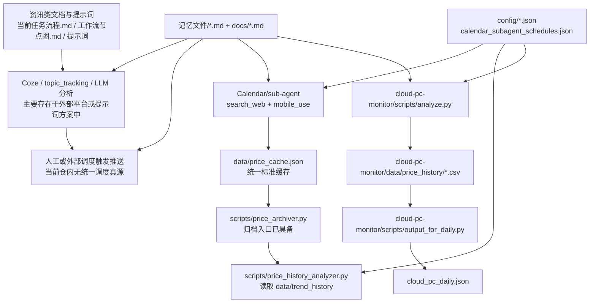

# 行情追踪助手真实架构图 + 断点清单 + 优化优先级

**整理时间**：2026-04-28
**目的**：区分“文档目标态”和“当前真实运行态”，作为后续优化唯一参考

> 2026-04-28 晚间更新：本文记录的是修复前断点。当前最新运行口径以 `docs/系统运行总规范_20260428.md`、`config/schedule.json`、`config/calendar_subagent_schedules.json`、`scripts/generate_daily_report_payload.py`、`scripts/render_report_cards.py`、`scripts/send_daily_report.py` 为准。
>
> 2026-04-29 更新：价格爬取执行方式已恢复为 Calendar -> sub-agent -> `search_web`/`mobile_use`。Python 脚本只负责验证、归档、生成日报，不再直接爬取价格。

---

## 一、结论摘要

当前这套系统不是一个已经完全整合的成品，而是由以下三部分拼接组成：

1. **资讯追踪方案层**
   - 主要存在于 `当前任务流程.md`、`工作流节点图.md`、`提示词_*.md`
   - 描述了 `topic_tracking -> 信号分级 -> 价格核查 -> 推送` 的理想流程

2. **主目录原型脚本层**
   - 主要在 `scripts/`
   - 提供价格抓取、归档、历史分析、告警、看门狗等模块

3. **cloud-pc-monitor 子系统**
   - 主要在 `cloud-pc-monitor/`
   - 提供另一套趋势分析、阈值自适应、日报输出逻辑

当前最大问题不是单点 bug，而是：

- **事实源不唯一**
- **状态存储未收口**
- **文档已超前于代码**
- **调度、推送、缓存分别维护自己的“记忆”**

这正是“记忆混乱、忘记推送、错误时间推送、缓存价格不准”的共同根因。

---

## 二、真实目录结构

当前导出包中实际存在的核心目录如下：

```text
行情追踪助手/
├── config/
├── docs/
├── scripts/
├── cloud-pc-monitor/
│   ├── config/
│   └── scripts/
├── templates/
├── 记忆文件/
├── 当前任务流程.md
├── 工作流节点图.md
├── 整合方案文档.md
└── 提示词_*.md
```

当前**仍不存在**但被多份文档和脚本依赖的关键文件：

```text
行情追踪助手/config/category_config.py
行情追踪助手/scripts/backfill.py
行情追踪助手/scripts/stop_loss.py
```

补充说明：

- `data/` 目录已于本轮整理中补建
- `data/price_cache.json` 和 `data/push_status.json` 已建立初版
- `config/schedule.json` 已建立初版
- `白天异动检测/` 已恢复为兼容入口，真实缓存仍统一写入 `data/price_cache.json`
- `config/thresholds_v2.py` 已补齐，供量价判断模块导入

这说明当前仓内仍有大量“设计已写、代码未完全接通”的情况，但状态层已经开始收口。

---

## 三、真实架构图

### 3.1 当前真实运行态



### 3.2 关键判断

- `资讯链路` 和 `价格链路` 没有真正收口到一个统一状态层
- `scripts/` 和 `cloud-pc-monitor/` 有两套相似能力，数据结构不同
- `data/price_cache.json` 已补建，但 `trend_history/`、`progress.json` 这类状态链路仍未完整落地
- 推送时序更多依赖外部 Coze 日程和提示词记忆，而不是仓内统一配置

---

## 四、文档目标态 vs 真实代码态

| 主题 | 文档目标态 | 当前真实代码态 | 结论 |
|---|---|---|---|
| 配置中心 | `config/` 统一配置 | 部分统一，部分仍是子系统独立配置 | 半完成 |
| 价格缓存 | `data/price_cache.json` 统一真源 | 已建立初版缓存，主脚本开始同步写入，但下游尚未全部切换 | 进行中 |
| 历史归档 | `data/trend_history/` | 归档脚本已写，缓存入口已建立，但历史链路尚未验证闭环 | 进行中 |
| 调度中心 | 统一日程和时间窗口 | `config/schedule.json` 已建立，外部日程仍需按它调用 | 进行中 |
| 推送状态 | 可重试、可补推、可防重 | `data/push_status.json` 已建立，推送前由 `report_guard.py` 校验 | 进行中 |
| 看门狗 | 独立 watchdog + progress | 已统一到 `data/progress.json`，并恢复 `白天异动检测/` 兼容目录 | 进行中 |
| 量价判断 | 已接入阈值体系 | `config/thresholds_v2.py` 已补齐 | 进行中 |
| 云电脑分析 | 可并入日报 | 子系统能独立输出，但与主系统未完全统一 | 半完成 |

---

## 五、核心模块真实职责

### 5.1 方案与记忆层

- `当前任务流程.md`
  - 定义理想执行流程、推送时间、配额规则
- `工作流节点图.md`
  - 定义双流架构：资讯流 + 价格流
- `提示词_价格数据汇总.md`
  - 定义价格信息整理口径
- `提示词_信号分级判断.md`
  - 定义资讯分级规则
- `提示词_推送格式.md`
  - 定义输出格式
- `记忆文件/*.md`
  - 保存人设、工具经验、历史决策、密钥等

判断：
- 这些文件承载了大量“执行规则”
- 但规则重复、过期和冲突明显
- 不适合作为运行时唯一事实源

### 5.2 主目录脚本层

- Calendar/sub-agent 价格采集链路
  - 作用：通过 `search_web` 获取闲鱼自由市场价，通过 `mobile_use` 获取闲鱼官方回收价和爱回收价
  - 真实输出：`data/price_cache.json`
  - 当前状态：执行模板已恢复到 `扣子原价格爬取功能/`，`scripts/deprecated/price_crawler.py` 仅作为历史废弃入口保留

- `scripts/price_archiver.py`
  - 作用：将 `data/price_cache.json` 归档到 `data/trend_history/`
  - 当前状态：上游统一缓存已建立，但归档闭环还未跑通验证

- `scripts/price_history_analyzer.py`
  - 作用：读取 `trend_history/` 做趋势、偏离度、连续涨跌分析
  - 问题：分析逻辑较完整，但依赖历史归档已存在

- `scripts/watchdog.py`
  - 历史作用：读取 `白天异动检测/progress.json` 监控任务卡死
  - 当前修复：统一读取 `data/progress.json`
  - 当前修复：`白天异动检测/` 已恢复为兼容入口，真实进度仍以 `data/progress.json` 为准

- `scripts/alerting.py`
  - 作用：企业微信告警
  - 问题：Webhook 硬编码，且只负责发送，不维护推送状态

- `scripts/volume_price_judge.py`
  - 作用：量价场景判断
  - 问题：依赖缺失，当前不可运行

### 5.3 cloud-pc-monitor 子系统

- `cloud-pc-monitor/scripts/analyze.py`
  - 作用：读 `cloud-pc-monitor/data/price_history/*.csv` 做趋势和异常检测
  - 问题：与主系统历史结构不同

- `cloud-pc-monitor/scripts/threshold.py`
  - 作用：阈值自适应
  - 问题：使用自身 `data/threshold_config.json`，未纳入主配置中心

- `cloud-pc-monitor/scripts/output_for_daily.py`
  - 作用：产出 `cloud_pc_daily.json`
  - 问题：它期望读取 cloud-pc-monitor 自己的数据层，不是主系统统一状态层

---

## 六、断点清单

以下断点按“会直接导致错推、漏推、不准、失忆”的程度排序。

### D1. 运行事实源分裂

表现：
- 文档说读 `data/price_cache.json`
- 主抓取脚本同时写 `data/latest.json` 和 `data/price_cache.json`
- 云电脑分析脚本读 `cloud-pc-monitor/data/price_history/*.csv`
- 记忆文档又说系统“已整合完成”

影响：
- 同一产品可能在不同模块里有三份价格
- 推送时读取哪个版本不稳定

### D2. 调度事实源缺失

表现：
- 推送时间在 `当前任务流程.md`、`README_文件清单.md`、`docs/MEMORY.md` 中有多处定义
- 当前仓内没有 `schedule.json` 之类的统一调度配置

影响：
- 模型容易按旧记忆推送
- 外部日程一旦改了，仓内无法反向校验

### D3. 推送状态未持久化

表现：
- 未见统一 `push_status.json` 或等价状态表
- 未见“是否已推送、是否补推、是否重试”的统一记录

影响：
- 忘记推送
- 重复推送
- 错过时间后没人知道是否需要补推

### D4. 价格缓存结构未统一

表现：
- 主抓取结果是扁平列表
- 当前已新增按 `product_id` 聚合的初版标准缓存
- 设计文档要求的是更细的 `prices_by_condition` 结构
- 历史分析又依赖另一套结构

影响：
- 价格准确性无法稳定校验
- 仍然难以完全区分“最新价”“归档价”“分析输入价”

### D5. 历史归档链路断裂

表现：
- 归档脚本依赖 `price_cache.json`
- 当前上游没有稳定生成这个文件的单一入口

影响：
- `trend_history/` 可能为空或不完整
- 历史趋势、偏离分析结果失真

### D6. 看门狗链路断裂

表现：
- 历史问题：`watchdog.py` 依赖 `白天异动检测/progress.json`
- 当前修复：统一改为 `data/progress.json`
- 当前修复：已恢复 `白天异动检测/` 兼容目录

影响：
- 旧流程可通过兼容目录找到模块边界
- 新流程统一通过 `data/progress.json` 做卡死检测

### D7. 模块重复建设

表现：
- 主目录有一套 `price_archiver.py` / `price_history_analyzer.py`
- `cloud-pc-monitor/` 又有自己的 `analyze.py` / `price_archiver.py`

影响：
- 修一个地方不等于系统修好
- 后续维护成本高

### D8. 记忆层过重且互相覆盖

表现：
- `docs/`、`记忆文件/`、提示词、配置中都在描述系统规则
- 旧方案、目标方案、当前现状混在一起

影响：
- 模型容易把“历史决策”当成“当前规则”
- 容易出现错时推送和错误判断

### D9. 依赖缺失

表现：
- `volume_price_judge.py` 依赖 `config/thresholds_v2.py`
- 文档提到 `category_config.py`、`backfill.py`、`stop_loss.py`
- 当前均不存在

影响：
- 一部分优化能力只是文档承诺，不是可运行能力

### D10. 敏感配置硬编码

表现：
- `alerting.py` 直接写了企业微信 Webhook

影响：
- 安全风险
- 环境切换困难

---

## 七、优化优先级

### P0：先止血

目标：解决“记忆混乱、错推漏推、缓存不准”的共因

1. **建立唯一运行事实源**
   - 配置只认 `config/`
   - 状态只认 `data/`
   - 说明只认一份新的运行文档

2. **新增统一调度配置**
   - 新建 `config/schedule.json`
   - 明确扫描时间、推送时间、静默期、重试策略、补推策略

3. **新增统一推送状态**
   - 新建 `data/push_status.json`
   - 记录每日应推、已推、补推、失败、重试

4. **定义统一价格缓存结构**
   - 新建规范版 `data/price_cache.json`
   - 所有抓取结果先写入标准化缓存，再做分析和推送

5. **瘦身运行记忆**
   - 将 `记忆文件/` 和 `docs/` 降级为参考材料
   - 运行提示词只引用最少规则

### P1：打通主链路

目标：让“抓取 -> 缓存 -> 归档 -> 分析 -> 推送”成为单链路

1. 固化 Calendar/sub-agent 工具调用模板
   - 保持“Calendar -> sub-agent -> `search_web`/`mobile_use`”执行方式
   - sub-agent 把结果写入统一缓存后，再调用 Python 后处理

2. 打通 `scripts/price_archiver.py`
   - 从统一缓存生成历史归档

3. 打通 `scripts/price_history_analyzer.py`
   - 只读取统一归档目录

4. 让日报和推送只读取一个分析出口

### P1：调度可靠性

目标：解决忘推和错时推送

1. 推送前检查 `schedule.json`
2. 推送前检查 `push_status.json`
3. 未到时间禁止推送
4. 已推送禁止重复推送
5. 超时未推送自动补推并留痕

### P2：去重复模块

目标：降低维护成本

1. 决定保留主目录分析链路还是 `cloud-pc-monitor` 分析链路
2. 另一套降级为兼容层或废弃
3. 清理失效文档与未落地承诺

### P2：高级能力收口

目标：恢复可持续扩展能力

1. 看门狗恢复为真实可用
2. 量价判断接回统一阈值
3. 阈值自适应接入主配置中心
4. 敏感配置改为环境变量或单独密钥文件

---

## 八、建议的实施顺序

建议严格按这个顺序做，不要跳步骤：

1. **先整理状态层**
   - 建 `data/`
   - 定义 `price_cache.json`
   - 定义 `push_status.json`

2. **再整理配置层**
   - 建 `config/schedule.json`
   - 明确唯一调度规则

3. **再改写入链路**
   - 统一抓取写入口
   - 统一归档写入口

4. **再改分析与推送**
   - 只读统一缓存和统一归档
   - 增加推送防重、防漏、防错时

5. **最后才处理高级能力**
   - 看门狗
   - 量价判断
   - 阈值自适应
   - 云电脑模块整合

---

## 九、下一步执行建议

下一阶段建议直接进入代码改造，优先实现以下最小闭环：

1. 新建 `config/schedule.json`
2. 新建 `data/price_cache.json` 初版结构
3. 新建 `data/push_status.json`
4. 固化 Calendar/sub-agent 模板，统一写入 `price_cache.json`
5. 补一层推送状态检查逻辑

如果按“收益最大、风险最低”的顺序，第一批代码改造应只动：

- `config/`
- `data/`
- `config/calendar_subagent_schedules.json`
- `扣子原价格爬取功能/日程描述模板_20260429.md`
- `扣子原价格爬取功能/工具调用模板_20260429.md`
- 新增一个轻量状态管理模块

先不要碰大段提示词和复杂分析逻辑，否则容易把“执行稳定性问题”和“分析质量问题”混在一起。

---

## 十、唯一参考原则

从这次整理开始，后续优化建议遵守以下原则：

1. **代码事实优先于记忆文档**
2. **统一状态优先于提示词记忆**
3. **运行配置优先于历史决策**
4. **真实可运行优先于设计完整**

只有这样，系统才会从“靠记忆拼装”变成“靠状态驱动运行”。
